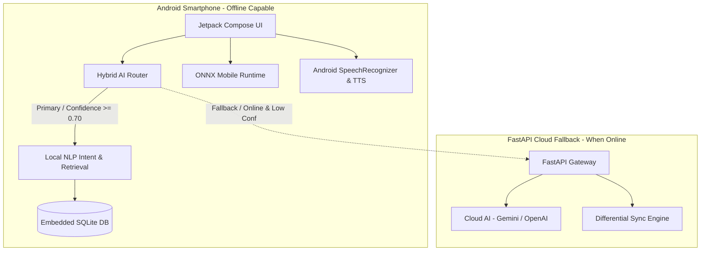

# ARCHITECTURE.md — KrishiMitra Architecture & Design

## 1. Architectural Philosophy

KrishiMitra is engineered around a core principle:
**"Never allow rural connectivity constraints to break critical agricultural operations."**

Unlike cloud-dependent chatbots that stall or fail when an Indian farmer walks into remote farmland with poor network coverage, KrishiMitra operates on an **Offline-First Hybrid Architecture**.

---

## 2. Subsystem Details

### A. Embedded Knowledge Retrieval (Zero Network Dependency)
* **Storage**: SQLite Database (`krishi_knowledge.db`, ~1.16 MB) pre-seeded into the APK assets.
* **Entities**:
  * 15 Major Indian Crops (Cereals, Pulses, Oilseeds, Cash Crops, Vegetables, Fruits)
  * 12 Crop Disease taxonomies with organic and verified chemical recommendations
  * 8 Central & State Government Schemes (PM-KISAN, PMFBY, KCC, PMKSY, etc.)
  * 5 Institutional Agriculture Loan structures
* **Provenance**: Every fact retains its institutional attribution (ICAR, DAC&FW, NABARD).

### B. On-Device NLP Engine (Kotlin Implementation)
* **Algorithm**: Multiclass regularized linear model trained on unigram and bigram TF-IDF features.
* **Model Size**: ~212 KB JSON format containing vocabulary (1,200 tokens), IDF weights, and class coefficients.
* **Execution**: Pure Kotlin matrix operations without heavy dependencies.
* **Latency**: ~2.5 ms per query on ARM Cortex-A53 CPU.
* **Zero Hallucination Guarantee**: Answers are strictly templated and retrieved from the verified knowledge base.

### C. Computer Vision Crop Disease Classifier
* **Model Architecture**: MobileAgriNet (5-stage depthwise-separable mobile convolutional neural network).
* **Input Resolution**: 224 x 224 x 3 normalized RGB channels.
* **Quantization**: Dynamic INT8/UINT8 weight quantization via ONNX Runtime Mobile.
* **Model Size**: 38.9 KB.
* **Inference Latency**: 2.2 ms average on CPU.
* **Threshold Policy**: Confidence ≥ 70% displays primary diagnosis; < 50% triggers the uncertain image quality advisory.

### D. Voice Assistant Pipeline
* **Interaction**: Hold-to-talk touch gesture avoids battery-draining always-on microphone listeners.
* **Recognition**: Android native `SpeechRecognizer` service with language tags `hi-IN` and `en-IN`.
* **Synthesis**: Android native `TextToSpeech` engine tuned at 0.92x speed for rural comprehension.

### E. Cloud AI Fallback & Backend Service
* **Framework**: Python 3.13 + FastAPI with asynchronous endpoints.
* **Abstraction**: `AIProvider` base class with `LocalAIProvider` and `CloudAIProvider`.
* **Security**: API keys remain server-side in `.env` and are never embedded inside the APK.
