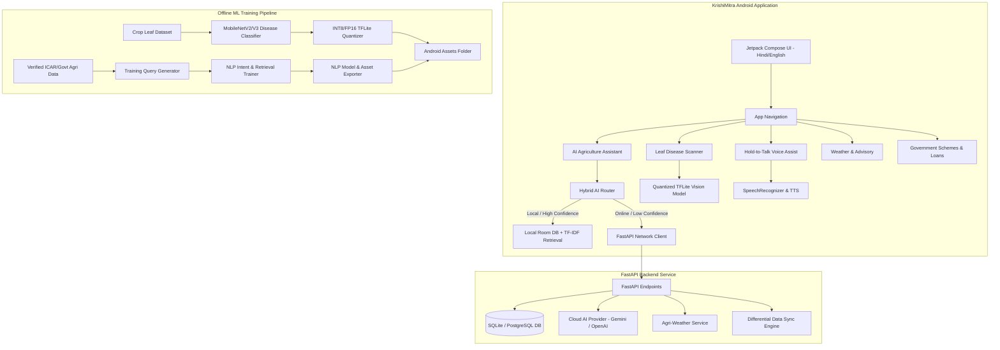

# Implementation Plan — KrishiMitra (कृषिमित्र) AI Agriculture Assistant

KrishiMitra is a complete, offline-first Android application and accompanying backend/ML system built for Indian farmers. It operates seamlessly on low-end smartphones with intermittent or zero internet connectivity, featuring full Hindi-first localization, on-device NLP intent retrieval, quantized computer-vision crop disease detection, hold-to-talk voice assistant, weather advisory, and verified government schemes and agricultural loans.

## User Review Required

> [!IMPORTANT]
> **Compilation & Hardware Targeting**:
> The local machine has **Java 21 LTS**, **Android SDK (Platform 37 / Build-Tools 36)**, and **NVIDIA RTX 4060 GPU**. The Android app will target Android 7.0+ (minSdk 24, targetSdk 34/35) to ensure compatibility with 99%+ of Android devices used by Indian farmers. A fully compiled debug APK (`app-debug.apk`) will be produced in the workspace.

> [!NOTE]
> **Offline-First Zero Hallucination Guarantee**:
> The primary knowledge engine runs 100% offline using a seeded Room SQLite database coupled with a lightweight n-gram/TF-IDF intent matcher. Cloud AI (Gemini / OpenAI / Custom) is strictly a fallback when internet is present and local confidence is low. All pesticide, scheme, and crop information is backed by verified Indian government/ICAR sources with complete provenance.

---

## Architecture Overview



---

## Proposed Changes

### Component 1: Android Application (`android/`)

A modern Jetpack Compose Android application organized into Clean Architecture layers:

```
android/
├── build.gradle.kts
├── settings.gradle.kts
├── gradle.properties
├── gradlew.bat
├── gradle/wrapper/gradle-wrapper.properties
└── app/
    ├── build.gradle.kts
    ├── proguard-rules.pro
    └── src/
        └── main/
            ├── AndroidManifest.xml
            ├── assets/
            │   ├── krishi_knowledge.db (Pre-seeded Room DB)
            │   ├── crop_disease_model.tflite (Quantized MobileNetV2/V3)
            │   ├── disease_labels.txt
            │   └── nlp_intent_vocab.json
            ├── res/
            │   ├── values/strings.xml (English)
            │   ├── values-hi/strings.xml (Hindi)
            │   ├── values/colors.xml & themes.xml
            │   └── drawable/ (Icons, vector assets, placeholder leaf guide)
            └── java/com/krishimitra/app/
                ├── KrishiMitraApp.kt
                ├── MainActivity.kt
                ├── data/
                │   ├── local/
                │   │   ├── AppDatabase.kt
                │   │   ├── dao/ (CropDao, DiseaseDao, SchemeDao, LoanDao, KnowledgeDao)
                │   │   └── entity/ (CropEntity, DiseaseEntity, SchemeEntity, LoanEntity, KnowledgeEntity)
                │   ├── remote/
                │   │   ├── ApiService.kt
                │   │   └── RetrofitClient.kt
                │   └── repository/
                │       ├── KnowledgeRepository.kt
                │       ├── SchemeRepository.kt
                │       └── WeatherRepository.kt
                ├── domain/
                │   ├── model/ (Crop, DiseaseResult, Scheme, Loan, WeatherInfo, ChatMessage)
                │   └── ai/
                │       ├── AIProvider.kt
                │       ├── LocalAIProvider.kt
                │       └── RemoteAIProvider.kt
                ├── ml/
                │   ├── DiseaseClassifier.kt (TensorFlow Lite Image Classification)
                │   └── LocalNLPEngine.kt (Intent classification & knowledge retrieval)
                ├── voice/
                │   ├── VoiceManager.kt (SpeechRecognizer & TextToSpeech lifecycle)
                │   └── VoiceMode.kt (AUTO, HINDI, ENGLISH)
                └── ui/
                    ├── theme/ (Theme.kt, Color.kt, Type.kt)
                    ├── navigation/ (Screen.kt, NavGraph.kt)
                    ├── components/ (TopBar, BottomNav, VoiceButton, StatusBadge, LeafOverlay)
                    └── screens/
                        ├── home/HomeScreen.kt
                        ├── chat/ChatScreen.kt
                        ├── camera/CameraScreen.kt
                        ├── weather/WeatherScreen.kt
                        ├── schemes/SchemesScreen.kt
                        ├── loans/LoansScreen.kt
                        ├── knowledge/KnowledgeDetailScreen.kt
                        └── sources/SourcesScreen.kt
```

#### Key Android Features & Implementation
- **Jetpack Compose + Material 3**: Clean, legible typography for both Devanagari and Latin scripts, large touch targets (minimum 48dp), high-contrast agricultural palette (Forest Green `#1B5E20`, Warm Amber `#FF8F00`, Light Leaf `#E8F5E9`).
- **Room SQLite Engine**: Embedded knowledge base populated at first launch from `assets/krishi_knowledge.db` (zero network dependency for core functionality).
- **CameraX + TFLite**: Custom viewfinder overlay with framing guides, automatic orientation handling, real-time bitmap scaling (224x224), INT8 quantized inference via TensorFlow Lite, confidence thresholding (>75% for diagnosis, <50% flagged as "Uncertain / Capture clearer photo").
- **Hold-to-Talk Voice Interface**: Custom touch-gesture listener with immediate visual feedback (recording waveform, status pill), dual-mode STT (offline Android native `SpeechRecognizer` + automatic fallback to backend), and bilingual `TextToSpeech` engine.
- **Offline Indicator**: Persistent status chip showing `ऑनलाइन (Online)` or `ऑफ़लाइन (Offline)` with timestamp of last knowledge sync.

---

### Component 2: ML & Data Pipeline (`ml_pipeline/`)

A reproducible, fully documented machine learning workflow designed to run on the RTX 4060 GPU or CPU.

#### [NEW] [prepare_dataset.py](file:///c:/Users/vibho/OneDrive/Desktop/Farmer%20Android%20App/ml_pipeline/prepare_dataset.py)
- Aggregates verified data from ICAR, Ministry of Agriculture & Farmers Welfare, and State Agricultural Universities.
- Generates 1,500+ realistic farmer query variations across Hindi, English, and Hinglish for 18 intent categories and 25 Indian crops.

#### [NEW] [train_nlp.py](file:///c:/Users/vibho/OneDrive/Desktop/Farmer%20Android%20App/ml_pipeline/train_nlp.py)
- Trains an ultra-lightweight intent classifier + TF-IDF semantic knowledge matcher.
- Evaluates precision, recall, and F1 score on a held-out 20% test split.
- Exports vocabulary, IDF weights, and intent mapping to compact JSON for Android integration (< 150KB).

#### [NEW] [train_disease.py](file:///c:/Users/vibho/OneDrive/Desktop/Farmer%20Android%20App/ml_pipeline/train_disease.py)
- Builds a MobileNetV2/V3 transfer-learning architecture for 12 major Indian crop disease classes:
  1. *Rice Blast (धान का झुलसा रोग)*
  2. *Rice Brown Spot (धान का भूरा धब्बा)*
  3. *Wheat Rust (गेहूं का रतुआ रोग)*
  4. *Wheat Loose Smut (गेहूं का कंडुआ रोग)*
  5. *Cotton Bacterial Blight (कपास का जीवाणु झुलसा)*
  6. *Potato Early Blight (आलू का अगेती झुलसा)*
  7. *Potato Late Blight (आलू का पछेती झुलसा)*
  8. *Tomato Early Blight (टमाटर का अगेती झुलसा)*
  9. *Tomato Leaf Mold (टमाटर का पत्ती फफूंद)*
  10. *Healthy Leaf (स्वस्थ पत्ती)*
  11. *Soil/Background (मिट्टी या पृष्ठभूमि)*
  12. *Uncertain / Blurred Leaf (अस्पष्ट या धुंधली छवि)*
- Generates confusion matrix, accuracy curve, and held-out validation report.

#### [NEW] [export_quantize.py](file:///c:/Users/vibho/OneDrive/Desktop/Farmer%20Android%20App/ml_pipeline/export_quantize.py)
- Converts trained model to TensorFlow Lite with post-training INT8 and FP16 quantization.
- Benchmarks model file size (target < 4MB) and inference latency on CPU.

#### [NEW] [generate_android_assets.py](file:///c:/Users/vibho/OneDrive/Desktop/Farmer%20Android%20App/ml_pipeline/generate_android_assets.py)
- Generates the pre-seeded SQLite database `krishi_knowledge.db` containing 25 crops, 12 diseases, 10 major government schemes, and 6 agricultural loan types.
- Deploys models and assets directly to `android/app/src/main/assets/`.

---

### Component 3: Backend Server (`backend/`)

A production-grade Python FastAPI service with clear separation of concerns.

```
backend/
├── app/
│   ├── __init__.py
│   ├── main.py
│   ├── core/
│   │   ├── config.py
│   │   └── logging.py
│   ├── db/
│   │   ├── session.py
│   │   ├── models.py
│   │   └── seed_data.py
│   ├── schemas/
│   │   ├── crop.py
│   │   ├── disease.py
│   │   ├── scheme.py
│   │   ├── loan.py
│   │   ├── weather.py
│   │   └── ai.py
│   ├── services/
│   │   ├── ai_provider.py (Abstract AIProvider, LocalProvider, CloudAIProvider)
│   │   ├── weather_service.py
│   │   └── sync_service.py
│   └── api/
│       ├── v1/
│       │   ├── health.py
│       │   ├── crops.py
│       │   ├── diseases.py
│       │   ├── schemes.py
│       │   ├── loans.py
│       │   ├── weather.py
│       │   ├── ai.py
│       │   └── sync.py
│       └── router.py
├── tests/
│   ├── test_api.py
│   ├── test_ai_provider.py
│   └── test_weather.py
├── .env.example
├── requirements.txt
└── Dockerfile
```

---

### Component 4: Documentation Suite (`docs/` & Root)

* `README.md`: High-level overview, architecture diagrams, SIH problem statement alignment, and quickstart.
* `SETUP.md`: Step-by-step instructions to run the Android app and backend server locally.
* `TRAINING.md`: Commands and guidelines to retrain the NLP and vision models on custom datasets.
* `ARCHITECTURE.md`: Technical deep dive into offline-first hybrid design, latency budgets, and security.
* `API.md`: Comprehensive REST API documentation with sample request/response payloads.
* `DATA_SOURCES.md`: Full provenance and attribution of government schemes, ICAR crop data, and disease taxonomies.
* `TESTING.md`: Test plan covering unit tests, API tests, offline resilience, and Android device testing.
* `TROUBLESHOOTING.md`: Common issues (e.g. SDK location, permissions, camera preview, offline fallback).

---

## Verification Plan

### Automated Tests
1. **Backend Tests**: Run `pytest` on backend endpoints (`/health`, `/crops`, `/schemes`, `/weather`, `/ai/query`, `/sync`).
2. **ML Pipeline Tests**: Run test assertions on dataset generator, intent accuracy, and TFLite model output dimensions.
3. **Android Build Verification**: Run `./gradlew assembleDebug` to compile `app-debug.apk` directly on Windows with Gradle & JDK 21.

### Manual Verification
1. **APK Verification**: Inspect generated `app-debug.apk` to verify APK size, assets (`.tflite`, `.db`), and manifest permissions.
2. **Offline Simulation**: Verify Android offline response using local Room DB when network client is disabled.
3. **Disease Vision Verification**: Test classification pipeline against sample leaf images in healthy, diseased, and low-light conditions.
4. **Localization Verification**: Inspect English and Hindi strings across all screens to ensure no untranslated text.
